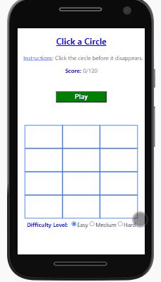
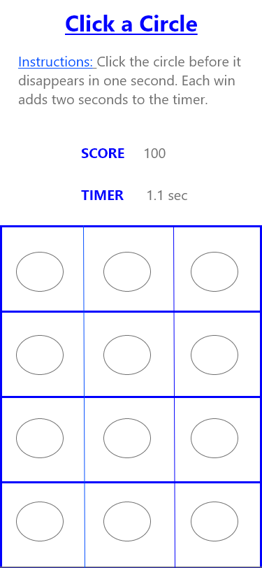

# Click-a-Circle

### Project Demo Link: [Click a Circle](https://click-a-circle.netlify.app/)

### Table of Contents

1. Purpose
2. Motivation
3. Wireframe
4. How to play
5. Technologies Used

### Purpose:

Whack-A-Mole style web game where users race to click disappearing circles

### Motivation:

The goal was to practice building apps in shorter time periods with React.

### WireFrame

### How to play:

- User will race against a random disappering cirlce and click it
- User can scale speed difficulty

### This app was built with the following technologies:

**React:** JavaScript front-end library for building user interfaces

**Git-Hub:** Web-based version control repository and Internet hosting service

**Abode XD** A wire-framing tool used to create a mockup/visual of what is to be coded

**JavaScript:** Object-oriented programming language for web pages

**HTML:** Mark-up language for creating web pages

**CSS:** A formatting language for styling web pages

_Created by JC Smiley in November of 2020_